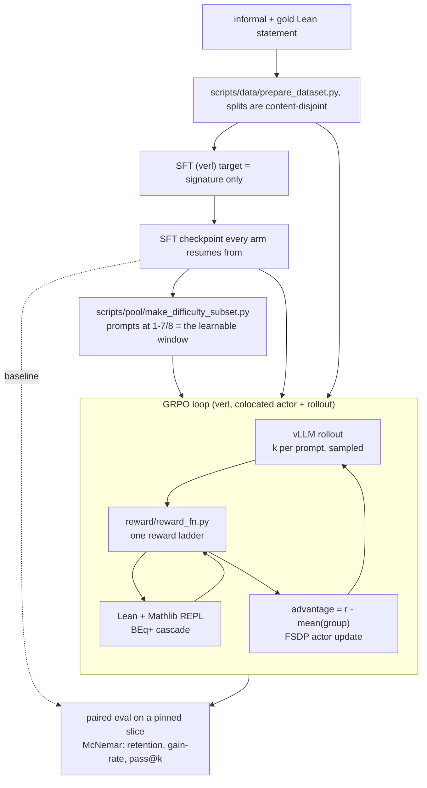
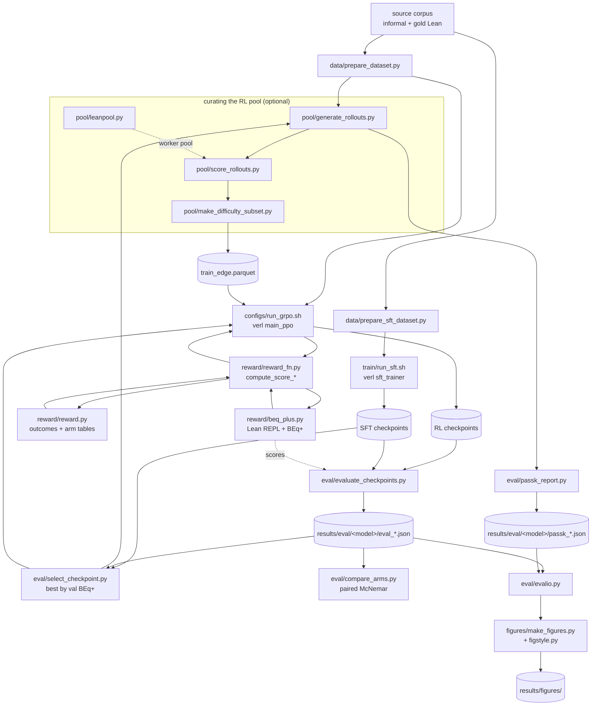

# lean-gym-rl

A gym for **RL on Lean 4 autoformalization**: swappable reward functions over a
real Lean/Mathlib verifier, plus a paired-evaluation harness built so reward
designs can be compared against each other honestly.

The task:

- **Theorem+proof pair**: informal statement *and*
  proof to a complete Lean 4 theorem *with* its proof. `reward/beq_plus.py`'s
  `check_own_proof` elaborates the candidate's own submitted proof (no forced
  `sorry`) and checks `#print axioms` against Lean's standard trio, so
  `reward/reward.py`'s full six-outcome ladder — `proved`, `solved` included —
  is reachable, not just the signature-only rungs. LoCoLib's native toolchain
  (Lean 4.23.0) differs from the Lean-Workbook pin (4.8.0-rc1), so this task
  runs against a second, separately-staged Mathlib checkout — see
  [datasets.md](datasets.md).

The stack is verl GRPO with a colocated FSDP actor and vLLM rollout, against
Lean 4 + Mathlib.

| knob | what it names | default |
|---|---|---|
| `BASE_MODEL` | the model SFT starts from | an instruct-tuned coder model |
| `DATA_DIR` | corpus root: splits, rollouts, pool parquets | `data_locolib` |
| `SFT_DIR` | `checkpoints/<SFT_DIR><TAG>` | `sft_3b_locolib_proof` |
| `SFT_LABEL` | eval label and merged-checkpoint prefix | `sft3blocolib_proof` |
| `RUN_PREFIX` | GRPO run name, `<RUN_PREFIX>_<ARM>` | `rl3b` |
| `PROJECT_NAME` | checkpoint project directory | `beqplus_rl_poc` |

## Pipeline




## Setup

```bash
make setup          # local: venv + verl + Lean/Mathlib + model + data
make setup-hpc      # Compute Canada / DRAC
make check-toolchain
```

On a cluster, source the environment before anything else. Never run bare
`python`:

```bash
source hpc/cc_env.sh
```

## Train

Local, single GPU:

```bash
make smoke                 # ~1 step, proves the loop runs
make sft                   # SFT from the base model
make submit ARM=gated STEPS=90
```

On SLURM, one arm is one job. Arms differ in **one thing at a time**.
`hpc/submit.sh` wraps `sbatch` and names the job `<task>_<model>-<arm>_<dataset>`
before it queues, so `squeue` is readable while jobs are still pending:

```bash
bash hpc/submit.sh hpc/grpo.slurm ARM=outcome DATA_DIR=data_locolib
#   -> grpo_3b-outcome_locolib
```

Plain `sbatch` still works; the job then renames itself when it starts.

```bash
# SFT, then pick the best epoch by validation BEq+ rather than assuming the last.
sbatch --export=ALL hpc/sft.slurm
sbatch --export=ALL hpc/eval_sft.slurm

# Optional: continued pre-training on Lean statements, before the task SFT.
sbatch --export=ALL hpc/midtrain.slurm

# Curate the prompt pool, then train an arm on it.
sbatch --export=ALL,SLICE=1 hpc/score_pool.slurm
sbatch --export=ALL hpc/build_edge_pool.slurm
sbatch --export=ALL,ARM=gated_edge,SERIES_TAG=edge,\
LR_WARMUP_RATIO=0.05,TOTAL_STEPS=90 hpc/grpo.slurm

# Evaluate every checkpoint of a run against the pinned validation slice.
sbatch --export=ALL,RUN=<run name>,N_EVAL=1000 hpc/grpo_eval.slurm

# pass@k for one checkpoint (capability, as opposed to pass@1 sharpening).
sbatch --export=ALL,CKPT_DIR=checkpoints/merged/<label>,LABEL=<label> hpc/passk.slurm
```

Point the same jobs at another corpus by overriding the knobs:

```bash
sbatch --export=ALL,DATA_DIR=data_other,SFT_DIR=sft_other,SFT_LABEL=sftother,\
TAG=other,TRAIN_FILE=$PWD/data_other/sft.parquet hpc/sft.slurm
```

Runs are chained 11h chunks. `resume_mode=auto` picks up from the last
checkpoint, so chain with `--dependency=afterany:` (**afterany**, not afterok:
a walltime kill is the expected end of a chunk, not a failure).

Compare and select:

```bash
python scripts/eval/compare_arms.py <arm a> <arm b>
python scripts/eval/select_checkpoint.py --baseline <sft label>
python scripts/figures/make_figures.py
```

## Rewards

One outcome vocabulary, six rungs, defined once in
[reward/reward.py](reward/reward.py). An arm is a **table over those outcomes**,
so arms differ only in what they pay, never in how an outcome is decided.

| outcome | meaning for a signature | `outcome` arm | `gated` | `typecheck` |
|---|---|---|---|---|
| `no_answer` | nothing usable, or the scorer failed | 0.00 | 0.00 | 0.00 |
| `no_elaborate` | Lean rejected it | 0.05 | 0.00 | 0.00 |
| `incomplete` | elaborates, no gold match (**the dead band**) | 0.15 | 0.00 | 1.00 |
| `incomplete_faithful` | BEq+ matches the gold | 0.50 | 1.00 | 1.00 |

`gated` additionally pays 0.25 when BEq+ proves one direction only, a partial
match the table has no row for.

Two rows of that table (`compiles`, `solved`) exist for proof generation. On the
signature-only task they are unreachable, since a signature has no proof body to
finish; on the LoCoLib theorem+proof-pair task (`--emit-proof`) they are real,
driven by `reward/beq_plus.py`'s `check_own_proof`.

**`gated` is the default, and pays nothing for elaboration.** The gate is
implicit: nothing that fails to elaborate can prove in either direction. The
flat floor is the point, because under GRPO a group with no semantic signal
produces zero advantage, so any term that varies inside such a group becomes the
only climbable signal there and the policy learns to farm it. `outcome` pays a
graded reward below BEq+ and so does not have that property; run it **against**
`gated`, not in place of it.

## Repo Breakdown

`scripts/` is grouped by pipeline stage. Anything from a closed investigation or
a one-off lives in `scripts/misc/`, so the live path is what you see first.

### Data

| file | what it does |
|---|---|
| `scripts/data/prepare_dataset.py` | Source corpus to verl parquet: RL and val splits, content-disjoint. Dedupes on the statement, not the id; ignoring that measured 93.4% content overlap across distinct ids and a 34.9pp generalisation gap. |
| `scripts/data/prepare_sft_dataset.py` | The same corpus as an SFT `messages` parquet. Writes an explicit system turn, because verl's SFT loss mask only covers the system turn and a lone assistant message trains on the tokenizer's injected default. |
| `scripts/data/prepare_midtrain_dataset.py` | A mid-training corpus of bare Lean statements. |
| `scripts/data/validate_midtrain_corpus.py` | Elaborates a sample of that corpus. Many library declarations lean on surrounding `variable` lines and open namespaces, so they do not stand alone; this measures how many do. |
| `scripts/data/prepare_locolib*.py` | The same builders for a second corpus (Mathlib, LLM-informalized). `prepare_locolib.py --emit-proof` builds the theorem+proof-pair variant instead of stripping the proof, off the SAME domain-stratified split so the two are directly comparable. |

### Train

| file | what it does |
|---|---|
| `scripts/train/run_sft.sh` | SFT and mid-training. Wraps `verl.trainer.sft_trainer`. |
| `configs/run_grpo.sh` | GRPO entrypoint. Wraps `verl.trainer.main_ppo` and points it at one `compute_score_*`. Read the header before tuning: each constant records the failure that set it. |
| `reward/reward.py` | The outcome vocabulary and the per-arm reward tables. One definition of what a rollout is worth. |
| `reward/reward_fn.py` | The verl `custom_reward_function` entry points, one per arm, each delegating to `reward.py`. All carry `@_never_raises`, because a reward that raises loses the JOB, not the rollout. |
| `reward/beq_plus.py` | The verifier. The vendored BEq+ cascade behind a persistent Lean REPL, plus `typecheck_ex` (signature only, forces `sorry`) and `check_own_proof` (elaborates the candidate's OWN proof as submitted, plus an axiom-cleanliness check). All Lean traffic goes through `_run()`, which restarts a dead REPL and clears the env cache. |

### Curating the RL pool

Optional, and the part that has moved results most: holding the prompt pool
fixed changed an outcome more than changing the reward did.

| file | what it does |
|---|---|
| `scripts/pool/generate_rollouts.py` | Sample k rollouts per prompt from a checkpoint, unscored. |
| `scripts/pool/score_rollouts.py` | Score them with BEq+ across parallel Lean REPLs. Resumable, flushed per result. |
| `scripts/pool/leanpool.py` | The worker-pool machinery those two share. A `Pool` hangs forever if a worker dies holding a task, so the iterator is driven by hand with a per-result timeout. |
| `scripts/pool/make_difficulty_subset.py` | Keep only prompts the policy gets 1 to k-1 of k right. A group scoring 0/k or k/k contributes exactly zero gradient under GRPO. Joins on prompt TEXT, never position. |

### Eval

| file | what it does |
|---|---|
| `scripts/eval/evaluate_checkpoints.py` | Generate with vLLM, score with BEq+, write `results/eval/<model_label>/eval_<label>-step<N>_n<n>.json` with a `per_example` array. |
| `scripts/eval/select_checkpoint.py` | Pick the best SFT checkpoint by validation BEq+, with the paired test that says whether the winner is actually ahead. |
| `scripts/eval/compare_arms.py` | Arm vs arm at matched steps, paired McNemar exact. |
| `scripts/eval/passk_report.py` | pass@k curve from a scored k-sample file. |
| `scripts/eval/evalio.py` | Canonical readers for cached eval and pass@k JSON. Recomputes rates on a prefix rather than trusting a stored `*_rate`. `RUN_PREFIX` and `BASELINE_LABEL` are env-overridable. |

`compare_arms.py` and `select_checkpoint.py` each carry their own McNemar and
depend on nothing else in `scripts/`.

### Figures

| file | what it does |
|---|---|
| `scripts/figures/make_figures.py` | Regenerate everything in `results/figures/`. |
| `scripts/figures/figstyle.py` | Shared style. `ARM_STYLE` is the registry: an arm missing from it is silently absent from every figure. |
| `scripts/figures/read_train_metrics.py` | verl's per-step training metrics for an arm. |
| `scripts/figures/make_arms_table.py` | Regenerate the results table at the top of `arms.md`. |

### Cluster

Every job sources `hpc/job_prelude.sh` first and names no model, size or corpus.

| file | what it does |
|---|---|
| `hpc/setup_cc.sh`, `hpc/lean_cache_and_build.sh` | One-time setup: venv, then Mathlib's prebuilt olean cache. The hard part of standing this up. |
| `hpc/cc_env.sh` | Module stack, venv, HF and Lean cache paths. Source before anything. |
| `hpc/job_prelude.sh` | Shared prelude: env, `unset ROCR_VISIBLE_DEVICES`, `stage_mathlib()`, and the naming knobs. |
| `hpc/sft.slurm`, `hpc/eval_sft.slurm` | SFT, and the eval sweep that picks the best epoch. |
| `hpc/midtrain.slurm` | Continued pre-training on Lean statements, before the task SFT. Runs the corpus gate first. |
| `hpc/grpo.slurm`, `hpc/grpo_eval.slurm` | One arm per job, and the eval sweep over its checkpoints. |
| `hpc/score_pool.slurm`, `hpc/build_edge_pool.slurm` | Score a pool slice, then build the edge-of-competence pool. |
| `hpc/passk.slurm` | pass@k for one checkpoint. |


## How the files connect



Each SLURM job wraps one box: `sft` and `midtrain` wrap `run_sft.sh`, `grpo`
wraps `run_grpo.sh`, `eval_sft` and `grpo_eval` wrap `evaluate_checkpoints.py`,
`score_pool` wraps the rollout and scoring pair, `build_edge_pool` wraps
`make_difficulty_subset.py`, and `passk` wraps `passk_report.py`.

## Storage

`checkpoints/` and `repos/` are **symlinks into `$SCRATCH`**. `/home` is 50GB and
cannot hold them; a truncated optimizer write once killed a run at 46/50GB.
Checkpoints run tens of GB each with optimizer state, so budget accordingly.

`results/` is organized by task and model: `results/eval/<model_label>/` holds
every eval/gen/passk artifact for one checkpoint series, `results/train/` holds
training-time artifacts, `results/figures/` holds generated figures, and
`results/_archive/pre-reorg/` holds everything from before this layout existed
(untouched, kept for provenance). See CLAUDE.md's "Results layout" note for the
full convention.


# The training arms

Every arm is GRPO from `sft3b-step93`, batch 16, k=8 rollouts, single-turn. They
differ in **one thing at a time**: the reward, except `gated_edge`, where only
the prompt pool differs.

GRPO's advantage is `A_i = r_i − mean(r_group)`, so a group scoring 0/8 or 8/8
contributes exactly zero however large its reward.

## Reward format

Each reward is a ladder. The highest matching rung pays:

```
1.00   both directions prove          ← top rung
0.25   one direction proves
0.00   everything else
```

Two rules the ladders encode:

- **Only within-group spread matters.** GRPO subtracts the group mean, so a
  rung's absolute level is irrelevant. A flat rung creates no gradient.
- **What a rung pays for is what the policy learns.** A rung that pays for
  elaboration teaches elaboration.

## Our arms

```
gated ── the flagship. BEq+ only; type-check pays NOTHING.
  1.00   both directions prove
  0.25   one direction proves
  0.00   everything else            ← 55.6% of rollouts land here

gated_edge ── identical reward to `gated`; only the pool differs.
  train_edge.parquet = prompts scoring 1-7/8 at k=8, so ~100% of groups can
  produce a non-zero advantage instead of ~46%.

typecheck ── the exploitability probe. Known gameable; run to prove it.
  1.00   elaborates
  0.00   everything else
```

<!-- ARMS-TABLE:START -->

## Related work

Same ladder format, for comparison.

```
FormaRL: gold-free, LLM judge in the loop
  1.00   compiles AND an LLM judges it consistent with the informal statement
  0.00   otherwise
  ProofNet pass@1 4.04% -> 26.15%, from 859 unlabeled problems.

Online RL for Autoformalization: the closest prior work to ours
  composite: type-check + BEq/BEq+ where a gold exists
                        + continuous embedding similarity where it does not
  Essentially our `gated` + `guided` pair, arrived at independently.

Cycle-consistency fine-tuning: gold-free, continuous
  reward = agreement between the original NL and a back-translation of the
           generated Lean.  +0.156 mean cycle consistency over SFT.

Roundtrip verification and repair: not a reward
  formalize -> back-translate -> re-formalize, then SMT-check the two
  formalizations for equivalence. A repair loop (44.7% -> 85.3%).

PDA (Process-Driven Autoformalization): deterministic process supervision
  Lean's FIRST ERROR LOCATION with step-level loss, training a verifier.
  Grades how far the output got, so it addresses the 23.3% that fail to
  elaborate, not our dead band.

Process-Verified RL for Theorem Proving: tactic-level
  per-tactic soundness + earliest failing step, folded into a GRPO advantage.
  PROOF generation: there the statement is an INPUT, so "it compiles" means
  "you proved it". Does not transfer to statement generation.

Signal-Coverage Matrix: stratifies type vs semantic errors and proposes cheap
  deterministic vacuity / suspicious-statement checks explicitly as RL reward
  components. Closest in spirit to what we propose next.
```

**The pattern:** everyone who gets a dense signal on the *semantic* band buys it
with an LLM (FormaRL, cycle-consistency, roundtrip). The deterministic work
(PDA, Process-Verified) grades syntax or proofs, not statement meaning. We are
staying deterministic, so we need a *verified* semantic rung.